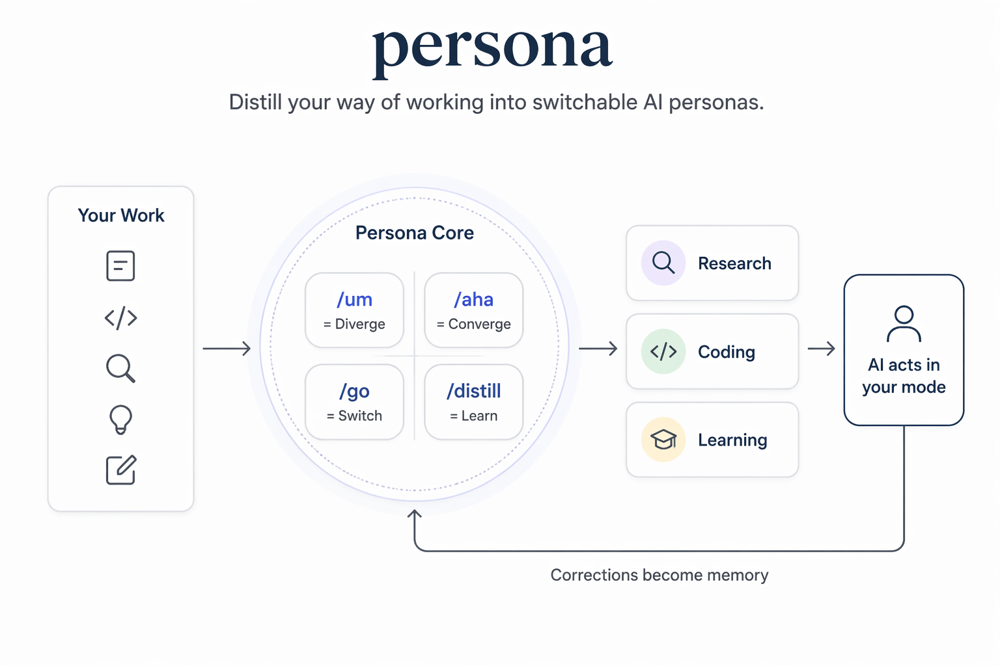

# persona

<p align="center">
  
</p>

> 你不是在配置工具。你是在蒸馏自己。

知识工作者每天在不同角色间切换——写代码时你是工程师，整理笔记时你是策展人，写专利时你是发明人。每个角色有不同的思考方式、行动模式、审美偏好。

**Persona 把这些"你在不同场景下怎么工作"变成可切换、可积累、可分享的人格切片。**

用得越多，AI 越懂你。不是因为魔法，是因为你的每一次纠正都被记住、被蒸馏、被内化。

---

## 安装

把这句话复制给你的 AI Agent：

> 请帮我安装 persona：克隆 `https://github.com/itxaiohanglover/obsidian-harness.git` 到 `~/.claude/persona`，然后执行 `~/.claude/persona/install.sh`；如果缺少依赖，请自动检查并告诉我下一步怎么处理。

---

## 使用

不需要记命令。感知当下状态：

| 你的状态 | 打 | AI 做什么 |
|---------|-----|----------|
| 脑子里一团糟 | `/um` | 帮你外化、拆解、发现方向 |
| 想看看进度 | `/aha` | 汇总变更、提炼清晰、建议下一步 |
| 要换个工作模式 | `/go coding` | 切换到编码人格，加载对应 prompt |
| 积累够多了 | `/distill` | 把零散记忆精炼成画像 |
| 想建新场景 | `/new` | 引导式创建你的专属人格包 |

### 典型工作流

```
/go research       ← 进入调研模式
/um                ← "你在研究3个子课题，信息还缺哪块？"
/um [[竞品分析]]    ← 深入这篇笔记，拆解对比维度
/aha               ← "已收集12条信息卡片，可以综合出报告了"
/distill           ← 把这些天的偏好精炼成画像
```

---

## 场景

场景 = 工作人格包。切换场景就是切换思考方式。

### 原子场景（内置）

| 场景 | 你是谁 | 能做什么 |
|------|--------|---------|
| `research` | 探索者 | 调研拆解、信息收集、对比分析、综合报告、概念可视化 |
| `coding` | 工程师 | 项目笔记、开发日志、架构图、**可视化三选一**（Mermaid/Canvas/Excalidraw） |
| `learning` | 学习者 | **资料→学习库**、互动测验、进度追踪、概念解释、闪卡复习 |

### 继承场景（示例）

| 场景 | 继承自 | 增加什么 |
|------|--------|---------|
| `patent-writing` | research | 权利要求书、说明书、现有技术检索、专利附图 |

```
/go research
/go coding
/go learning
/go patent-writing
```

想创建自己的场景？`/new` 一步一步引导你，或者继承已有场景只写差异部分。

---

## 越用越懂你

```
使用 → 你纠正 AI → 存入 _memory → /distill → 精炼 _profile → 下次更懂你
```

完全透明——打开 `prompts.json` 就能看到 AI 记住了什么。可编辑、可删除、可重写。没有黑箱。

---

## 设计哲学

- **双钻石** — 知识工作只有两种状态：发散（/um）和收敛（/aha）
- **场景即人格** — 不是工具变了，是你的工作模式变了
- **渐进蒸馏** — 不预设你是谁，从使用中逐步浮现画像
- **知行合一** — 你的"知"（怎么用工具）直接变成 AI 的"行"（替你执行）

---

## 进阶

<details>
<summary>自定义场景</summary>

用 `/new` 引导创建，或手动创建：

```
{vault}/.persona/scenes/my-research/
├── manifest.json    ← 依赖声明
└── prompts.json     ← 提示词 + _actions + _profile + _memory
```

支持 `_extends` 继承已有场景，只覆盖差异字段。用 `/go my-research --dry-run` 调试合并结果。

</details>

<details>
<summary>继承机制</summary>

manifest.json 中声明继承：

```json
{
  "scene": "patent-writing",
  "inherits": "research",
  "description": "专利撰写 — 继承 research，增加权利要求书能力",
  "requires": {
    "skills": ["+obsidian-markdown", "+mermaid-visualizer"]
  }
}
```

prompts.json 中的字段覆盖规则：

- 有值 → 子覆盖父
- `null` / 缺失 → 继承父
- `""` → 显式清除
- requires.skills 中 `+skill-name` 表示在父级基础上追加

最多 3 层继承，自动循环检测。

</details>

<details>
<summary>文件结构</summary>

```
~/.claude/persona/          ← 本仓库（全局安装）
├── commands/*.md           ← slash commands
├── scenes/*/               ← 内置场景
├── registry.json           ← skill/mcp/plugin 注册表
└── install.sh

{vault}/.persona/           ← 每个 vault 的本地状态
├── active-scene.json       ← 当前激活的场景
├── profile.md              ← 你的全局画像
├── contexts/{scene}.md     ← 场景上下文变量
└── scenes/*/               ← 用户自建场景
```

</details>

---

## License

MIT
